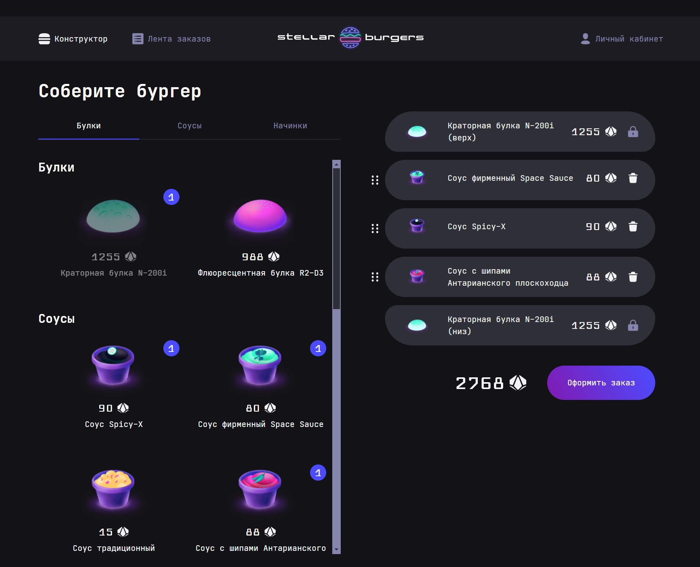

# Frontend "Stellar Burgers"

Приложение для заказа бургеров.

## Инструкции по запуску

1. Создайте папку и перейдите в нее.
2. Склонируйте в неё репозиторий.
3. Установите зависимости:\
    `npm install`
4. Запустите проект в режиме разработки:\
    `npm start`
5. Откройте [http://localhost:3000](http://localhost:3000), чтобы просмотреть проект в браузере. При редактировании кода страница будет обновляться.

Команда `npm run build` собирает проект для продакшена в папку `build`.

# Реализованный функционал

- регистрация и авторизация пользователя;
- редактирование профиля;
- история заказов в личном кабинете;
- лента заказов всех пользователей;
- сбор бургера и оформление заказа;
- уведомление о принятии заказа.

# Планы по доработке

- обновление завимостей

# Технологии

- React, React Router
- Redux
- TypeScript
